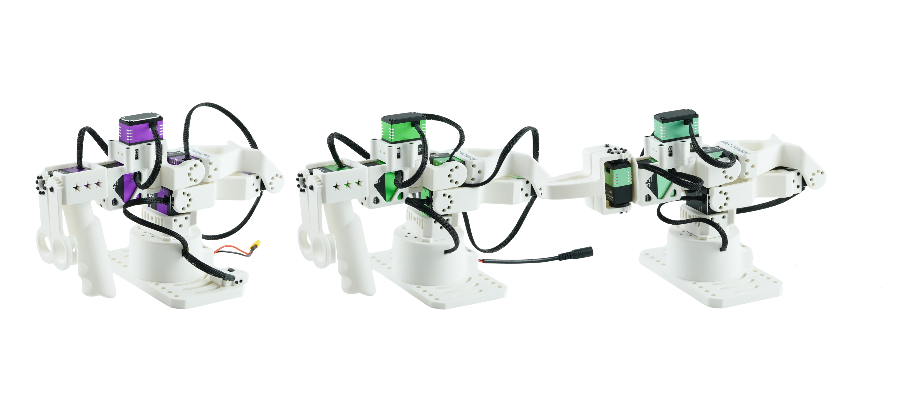
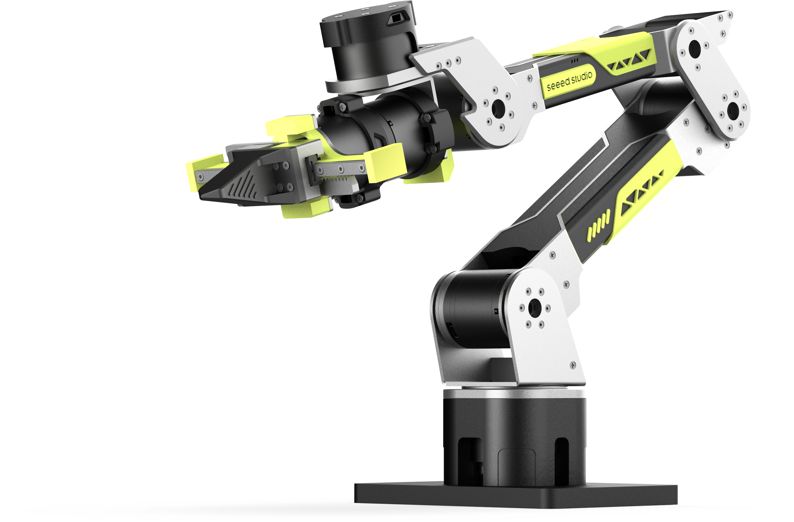
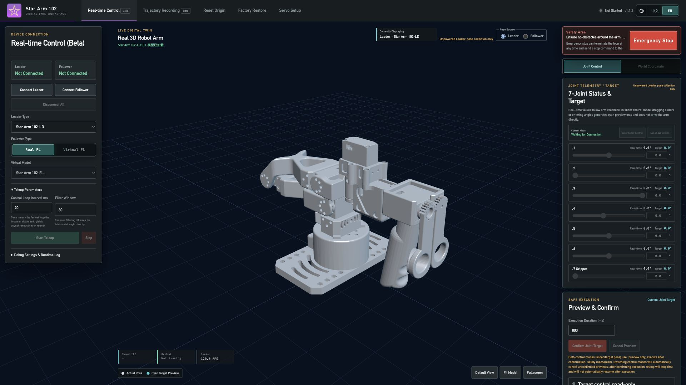

<h1 align="center">🦾 Star Arm 102</h1>

<p align="center">
  <strong>Open-Source 6+1 DOF Robot Arm for LeRobot</strong><br>
  Teleoperate. Learn from demonstrations. Run your first AI task.
</p>

<p align="center">
  <a href="docs/specifications.md"></a>
  <a href="lerobot/README.md"></a>
  <a href="python-sdk/README.md"></a>
  <a href="ros2-humble/README.md"></a>
  <a href="lerobot/examples/act_pick/README.md"></a>
</p>

<p align="center">
  <a href="README.md"></a>
  <a href="README.zh.md"></a>
</p>

<p align="center">
  <a href="https://fashionstar.com.hk/">🌐 Official Website</a> ·
  <a href="https://fashionstar.com.hk/robot-arm/star-arm-102">🔭 Series Overview</a> ·
  <a href="#where-to-buy">🛒 Where to Buy</a> ·
  <a href="https://fashionstar.com.hk/support/">💬 Support</a>
</p>

<p align="center">
  <a href="https://fashionstar.com.hk/store/collections/robot-arm/star-arm-102/">
    
  </a>
</p>

## 📑 Contents

- [📖 Introduction](#introduction)
- [🛒 Where to Buy](#where-to-buy)
- [🚀 Get Started](docs/getting-started.md)
- [🌐 Cross-Brand Follower Compatibility](#cross-brand-pairings)
- [🎮 Connect Your Leader to a Virtual Follower](#web-controller)
- [🤖 Run Your First AI Task](#run-your-first-ai-task)
- [⚙️ Hardware Resources](hardware/README.md)
- [🤗 LeRobot](lerobot/README.md)
- [💬 Natural Language Control](integrations/butterfly/README.md)
- [🦾 ROS 2 Humble Applications](ros2-humble/README.md)
- [🐍 Python SDK](python-sdk/README.md)
- [🧰 Control & Configuration Tools](tools/README.md)

[🛠️ Development Paths & Repository Structure](#development-paths) · [🔗 Related Projects](#related-projects)

---

<a id="introduction"></a>

## 📖 Introduction

Star Arm 102 is an open-source robot arm platform developed by **[Fashion Star](https://fashionstar.com.hk/)** for teleoperation, demonstration collection, and LeRobot learning workflows.

- **6+1 DoF, more wrist flexibility** — Six arm joints plus gripper control give you flexible wrist movement and versatile end-effector orientations.
- **Pieper-compliant kinematics** — Three consecutive parallel joint axes enable analytical inverse kinematics.
- **420 mm reach** — Across the LD, HD, and FL models for tabletop manipulation setups.
- **500g working payload** — The 102-FL follower features two high-torque brushless bus servo joints for task execution.
- **Two leader options** — Choose the lightweight 102-LD for free hand-guided teaching, or the pose-holding 102-HD with high-torque coreless bus servos for stable demonstrations.
- **Open-source resources** — STEP models, 3D-printing projects, BOMs, URDF robot descriptions, and control code for learning, building, and customization.
- **Teach by hand. Feel the load.** — Use ROS 2 for hand-guided teaching and feel changes in a supported follower's load through the 102-HD leader.
- **Pretrained ACT task** — Run the supplied block-placement policy on 102-FL without retraining, after completing the specified environment, calibration, and two-camera setup.

<a id="arm-specifications"></a>

## 🔧 Specifications

| Specification | Star Arm 102-LD | Star Arm 102-HD | Star Arm 102-FL |
| --- | --- | --- | --- |
| Arm type | Leader Arm | Pose-holding Leader Arm | Follower Arm |
| Power | 12V@3A | 12V@5A | 12V@8A |
| Reach | 420mm | 420mm | 420mm |
| DoF | 6+1 | 6+1 | 6+1 |
| Payload | — | — | 500g (70% reach recommended) |
| Repeatability / Encoder | 12-bit magnetic encoder | 12-bit magnetic encoder | 2mm |
| Joint Motion Range | Joint 1: ±110°<br>Joint 2: 0°–180°<br>Joint 3: 0°–270°<br>Joint 4: ±90°<br>Joint 5: ±65°<br>Joint 6: ±150°<br>Handle: 0°–90° | Joint 1: ±110°<br>Joint 2: 0°–180°<br>Joint 3: 0°–270°<br>Joint 4: ±90°<br>Joint 5: ±65°<br>Joint 6: ±150°<br>Handle: 0°–90° | Joint 1: ±110°<br>Joint 2: 0°–180°<br>Joint 3: 0°–270°<br>Joint 4: ±90°<br>Joint 5: ±65°<br>Joint 6: ±150°<br>Gripper: 0°–90° |
| Servos | RA8-U01H-M × 4<br>RA8-U02H-M × 1<br>RA8-U03H-M × 2 | RP8-U45H-M × 4<br>RP8-U45H-M-C029 × 1<br>RP8-U45H-M-C028 × 2 | RA8-U35H-M × 3<br>RX8-U50H-M × 2<br>RA8-U27H-M-C005 × 1<br>RA8-U35H-M-C047 × 1 |
| Arm weight | 721g | 883g | 791g |
| Communication | UART / UC-01 | UART / UC-01 | UART / UC-01 |
| Operating Temperature | 0–40°C | 0–40°C | 0–40°C |

<a id="where-to-buy"></a>

## 🛒 Where to Buy

Choose your [Star Arm 102](https://fashionstar.com.hk/store/collections/robot-arm/star-arm-102/) as a **fully assembled arm** to get started sooner, or a **DIY kit** to build it yourself. **In-stock options, ready to ship.** Select your model and configuration on the product page for current availability.

**International store:**

| Product | Shop | Product overview |
| :---: | --- | --- |
| <a href="https://fashionstar.com.hk/store/product/star-arm-102-ld/"></a> | **[Shop&nbsp;102&#8209;LD&nbsp;→](https://fashionstar.com.hk/store/product/star-arm-102-ld/)** | **Lightweight leader arm** for hand-guided teaching, teleoperation, and demonstration collection; torque-disabled joints move freely |
| <a href="https://fashionstar.com.hk/store/product/star-arm-102-hd/"></a> | **[Shop&nbsp;102&#8209;HD&nbsp;→](https://fashionstar.com.hk/store/product/star-arm-102-hd/)** | **Pose-holding leader arm** with high-torque coreless bus servos, for stable demonstrations and extended data collection |
| <a href="https://fashionstar.com.hk/store/product/star-arm-102-fl/"></a> | **[Shop&nbsp;102&#8209;FL&nbsp;→](https://fashionstar.com.hk/store/product/star-arm-102-fl/)** | **Follower arm** for teleoperation and policy execution; two high-torque brushless bus servo joints, with a specified 500g working payload |

**Chinese purchase channel:** [Taobao](https://item.taobao.com/item.htm?id=1045277992605&skuId=6239416958433). Select the required model and kit option on the listing.

<a id="cross-brand-pairings"></a>

## 🌐 One Leader, Multiple Robot Platforms

Have a third-party follower? Explore Star Arm 102-LD / HD pairing resources by follower model, then choose the matching Python or LeRobot path.

<!-- reBot image: transparent image extracted with empty alpha margins trimmed from page 1 of Seeed Studio’s product sheet, hosted at https://akizukidenshi.com/goodsaffix/reBot_Arm_B601_DM_Physical_AI_Robotics_Arm.pdf -->
<table>
  <tr>
    <td align="center" width="25%"><a href="integrations/seeed-rebot/README.md"></a></td>
    <td align="center" width="25%"><a href="integrations/yam/README.md"></a></td>
    <td align="center" width="25%"><a href="integrations/galaxea-a1/README.md"></a></td>
    <td align="center" width="25%"><a href="integrations/lumos-touch/README.md"></a></td>
  </tr>
  <tr>
    <td align="center"><a href="integrations/seeed-rebot/README.md"><strong>Seeed reBot<br>B601-DM &amp; B601-RS →</strong></a></td>
    <td align="center"><a href="integrations/yam/README.md"><strong>YAM →</strong></a></td>
    <td align="center"><a href="integrations/galaxea-a1/README.md"><strong>Galaxea A1 →</strong></a></td>
    <td align="center"><a href="integrations/lumos-touch/README.md"><strong>Lumos Touch →</strong></a></td>
  </tr>
</table>

**[Cross-Brand Compatibility and Evidence →](integrations/compatibility.md)**

<a id="control-and-configuration-tools"></a>
<a id="web-controller"></a>

## 🎮 Connect Your Leader to a Virtual Follower

Start with your Star Arm 102 leader and a virtual follower in the web controller—no physical follower needed for this first experience.

- Get familiar with teleoperation and prepare your setup before connecting a physical follower.
- Follow the Wiki guide for supported leader models, connection steps, and calibration instructions.

[](https://fashionstar.com.hk/wiki/software/robot-arm/web-config-tool/)

**[Connect Your Leader →](https://fashionstar.com.hk/wiki/software/robot-arm/web-config-tool/)**

*Interface preview with no hardware connected. Tool versions, downloads, and detailed instructions are maintained in the Wiki.*

<a id="try-your-first-ai-task"></a>
<a id="run-your-first-ai-task"></a>

## 🤖 Run Your First AI Task

Watch Star Arm 102-FL pick up and place a block using our pretrained ACT model. Then try the same task on your own 102-FL—**no retraining required**.

<p align="center">
  <a href="https://github.com/user-attachments/assets/6774384d-f437-4aa9-a364-cd66eba965f7">
    
  </a><br>
  <a href="https://github.com/user-attachments/assets/6774384d-f437-4aa9-a364-cd66eba965f7"><strong>▶ Watch the ACT block-placement demo</strong></a>
</p>

**[Run the Demo on Your Arm →](lerobot/examples/act_pick/README.md)**

The guide walks you through the required hardware, two-camera setup, calibration, and workspace preparation.

<a id="teaching-and-force-feedback"></a>

## 🎮 Teach by Hand. Feel the Load.

Explore two ways to interact with your arm through ROS 2:

- **Hand-Guided Teaching** — Guide the arm by hand to demonstrate motion through ROS 2.
- **Force Feedback on 102-HD** — Feel changes in a supported follower's load as changes in resistance at the HD leader, bringing a sense of the remote arm's effort to your hand.

**[Explore ROS 2 Capabilities →](ros2-humble/README.md)**

*Feature-specific setup guides, supported arm combinations, and validation records are being prepared.*

<a id="development-paths"></a>
<a id="documentation-and-support"></a>
<a id="documentation-index"></a>
<a id="choose-your-setup"></a>
<a id="before-connecting"></a>

## 🛠️ Development Paths & Repository Structure

New to your arm? Start with [Get Started](docs/getting-started.md) to choose your equipment setup, check [hardware connections](docs/hardware-setup.md), and select a software path. See also [specifications and joint mapping](docs/specifications.md), [troubleshooting](docs/troubleshooting.md), and [validation records](docs/validation.md).

| Path | Use it for | Guide |
| --- | --- | --- |
| Cross-brand pairings | Follower-specific requirements, software paths, and validation status | [Pairing directory](integrations/README.md) |
| Python examples | Communication checks and direct LD/HD → FL teleoperation | [Python SDK examples](python-sdk/README.md) |
| LeRobot | Calibration, demonstrations, policies, and the released ACT model | [Choose an integration](lerobot/README.md) |
| ROS 2 Humble | Hand-guided teaching, force feedback on 102-HD, and robot-system development with RViz, MoveIt, and Gazebo | [ROS 2 guide](ros2-humble/README.md) |
| Hardware | Model-specific STEP, BOM, drawings, printing references, and status | [Hardware resources](hardware/README.md) |
| Partner applications | Natural-language task control and partner-maintained robot applications | [Partner integrations](integrations/README.md) |
| Control & Configuration Tools | Robot arm web control, servo debugging, and parameter configuration | [Tool directory](tools/README.md) |

The ACT release and the refactored HD/FL integration use different joint representations. Keep them in separate environments. See [versions and validation status](docs/compatibility.md).

<a id="repository-structure"></a>

### Repository structure

The `102-ld/` layout is expanded to show where hardware resources belong; `102-hd/` and `102-fl/` use the same main categories. LD additionally includes `drawings/images/` for existing drawing previews. Individual files, historical guides, and local caches are omitted.

```text
Star-Arm-102/
├── README.md
├── README.zh.md
├── hardware/
│   ├── 102-ld/
│   │   ├── step/
│   │   │   ├── assembly/
│   │   │   └── parts/
│   │   ├── printing/
│   │   │   ├── stl/
│   │   │   └── 3mf/
│   │   ├── drawings/
│   │   │   ├── pdf/
│   │   │   ├── cad/
│   │   │   └── images/
│   │   ├── bom/
│   │   ├── assembly-guide/
│   │   └── robot-description/
│   │       ├── urdf/
│   │       └── meshes/
│   ├── 102-hd/
│   ├── 102-fl/
│   └── robot-description/
├── integrations/
│   ├── seeed-rebot/
│   ├── yam/
│   ├── galaxea-a1/
│   ├── lumos-touch/
│   └── butterfly/
├── lerobot/
│   ├── examples/act_pick/
│   ├── lerobot-robot-stararm102/
│   ├── lerobot-teleoperator-stararm102/
│   └── lerobot-stararm102/
├── python-sdk/
├── ros2-humble/
│   └── src/
├── tools/
├── docs/
├── media/
├── scripts/
├── tests/
├── .github/
├── AGENTS.md
├── CONTRIBUTING.md
├── CHANGELOG.md
└── LICENSE.md
```

`hardware/robot-description/`: existing ROS model; applicable variant pending confirmation.

<a id="related-projects"></a>

## 🌐 Related projects

- [PiPER-Mate](https://github.com/servodevelop/piper-mate) — Fashion Star's PiPER-Mate project and teleoperation resources.
- [Fashion Star CAN bus SDK](https://github.com/servodevelop/servo-canbus-sdk)
- [Fashion Star UART/RS485 SDK](https://github.com/servodevelop/servo-uart-rs485-sdk)
- [Fashion Star LeRobot fork](https://github.com/servodevelop/lerobot) · [Upstream LeRobot](https://github.com/huggingface/lerobot)

Software directories and model release URLs remain available. English is the default entry; existing English and Chinese READMEs maintain matching sections, images, commands, and status. English-only detailed documents remain accessible through their links. The [historical Chinese homepage](README.legacy.zh.md) is retained for reference, not as the current operating guide.

[Changes](CHANGELOG.md) · [Contributing](CONTRIBUTING.md) · [License scope](LICENSE.md)
