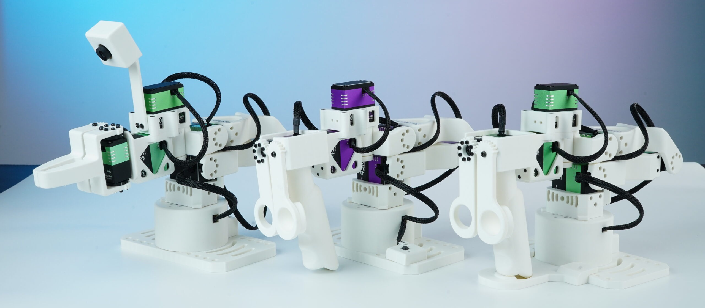

<h1 align="center">🦾 Star Arm 102</h1>

<p align="center">
  <strong>面向 LeRobot 的开源 6+1 自由度机械臂</strong><br>
  遥操作、示范学习，运行你的第一个 AI 任务。
</p>

<p align="center">
  <a href="docs/specifications.md"></a>
  <a href="lerobot/README.md"></a>
  <a href="python-sdk/README.md"></a>
  <a href="ros2-humble/README.zh.md"></a>
  <a href="lerobot/examples/act_pick/README.zh.md"></a>
</p>

<p align="center">
  <a href="README.md"></a>
  <a href="README.zh.md"></a>
</p>

<p align="center">
  <a href="https://fashionstar.com.hk/">🌐 官方网站</a> ·
  <a href="https://fashionstar.com.hk/robot-arm/star-arm-102">🔭 系列介绍</a> ·
  <a href="#where-to-buy">🛒 购买入口</a> ·
  <a href="https://fashionstar.com.hk/support/">💬 支持</a>
</p>

<p align="center">
  <a href="https://fashionstar.com.hk/store/collections/robot-arm/star-arm-102/">
    
  </a>
</p>

## 📑 目录

- [📖 产品介绍](#introduction)
- [🛒 购买入口](#where-to-buy)
- [🚀 开始使用](docs/getting-started.md)
- [🌐 跨品牌从臂兼容性](#cross-brand-pairings)
- [🎮 连接主臂，体验虚拟从臂](#web-controller)
- [🤖 运行第一个 AI 任务](#run-your-first-ai-task)
- [⚙️ 硬件资源](hardware/)
- [🤗 LeRobot](lerobot/README.md)
- [💬 自然语言控制](integrations/butterfly/README.zh-CN.md)
- [🦾 ROS 2 Humble 应用](ros2-humble/README.zh.md)
- [🐍 Python SDK](python-sdk/README.md)
- [🧰 控制与配置工具](tools/README.md)

[🛠️ 开发路径与目录结构](#development-paths) · [🔗 相关项目](#related-projects)

---

<a id="introduction"></a>

## 📖 产品介绍

Star Arm 102 是 **[Fashion Star](https://fashionstar.com.hk/)** 开发的开源机械臂平台，用于遥操作、示范数据采集和 LeRobot 学习流程。

- **6+1 自由度，灵活腕部姿态** — 六个机械臂关节加上夹爪控制，让腕部运动更灵活，末端姿态更丰富。
- **符合 Pieper 准则** — 三个连续关节轴相互平行，支持逆运动学解析求解。
- **420 mm 臂展** — LD、HD、FL 三款均采用该臂展，适用于桌面操作场景。
- **500g 工作负载** — 102-FL 从臂配备两个高扭矩无刷总线舵机关节，用于任务执行。
- **两种示教主臂** — 轻量型 102-LD 适合自由手动引导；姿态保持型 102-HD 采用高扭矩空心杯总线舵机，适合稳定示范。
- **开源资源** — 提供 STEP 模型、3D 打印项目、物料清单、URDF 机器人描述和控制代码，方便学习、制作与二次开发。
- **手动示教，感知负载** — 通过 ROS 2 进行拖动示教，并在 102-HD 主臂上感受受支持从臂负载变化带来的不同手感。
- **ACT 预训练任务** — 完成指定环境、校准和双相机配置后，即可在 102-FL 上运行提供的积木放置策略，无需重新训练。

<a id="arm-specifications"></a>

## 🔧 规格

| 规格 | Star Arm 102-LD | Star Arm 102-HD | Star Arm 102-FL |
| --- | --- | --- | --- |
| 产品类型 | 示教主臂（Leader Arm） | 姿态保持主臂（Leader Arm） | 执行从臂（Follower Arm） |
| 电源规格 | 12V@3A | 12V@5A | 12V@8A |
| 臂展 | 420mm | 420mm | 420mm |
| 自由度 | 6+1 | 6+1 | 6+1 |
| 负载 | — | — | 500g（建议在 70% 臂展处使用） |
| 重复定位精度／编码器 | 12-bit 磁编码器 | 12-bit 磁编码器 | 2mm |
| 关节运动范围 | 关节 1: ±110°<br>关节 2: 0°–180°<br>关节 3: 0°–270°<br>关节 4: ±90°<br>关节 5: ±65°<br>关节 6: ±150°<br>手柄: 0°–90° | 关节 1: ±110°<br>关节 2: 0°–180°<br>关节 3: 0°–270°<br>关节 4: ±90°<br>关节 5: ±65°<br>关节 6: ±150°<br>手柄: 0°–90° | 关节 1: ±110°<br>关节 2: 0°–180°<br>关节 3: 0°–270°<br>关节 4: ±90°<br>关节 5: ±65°<br>关节 6: ±150°<br>夹爪: 0°–90° |
| 舵机配置 | RA8-U01H-M × 4<br>RA8-U02H-M × 1<br>RA8-U03H-M × 2 | RP8-U45H-M × 4<br>RP8-U45H-M-C029 × 1<br>RP8-U45H-M-C028 × 2 | RA8-U35H-M × 3<br>RX8-U50H-M × 2<br>RA8-U27H-M-C005 × 1<br>RA8-U35H-M-C047 × 1 |
| 本机重量 | 721g | 883g | 791g |
| 通信方式 | UART / UC-01 | UART / UC-01 | UART / UC-01 |
| 工作温度 | 0–40°C | 0–40°C | 0–40°C |

<a id="where-to-buy"></a>

## 🛒 购买入口

选择适合你的 [Star Arm 102](https://fashionstar.com.hk/store/collections/robot-arm/star-arm-102/)：购买 **已装配整机**，更快开始使用；或选择 **DIY 套件**，亲手完成组装。**现货配置，可安排发货。** 请在商品页面选择型号与配置，查看当前库存。

**国际商城：**

| 产品图片 | 购买 | 产品简介 |
| :---: | --- | --- |
| <a href="https://fashionstar.com.hk/store/product/star-arm-102-ld/"></a> | **[购买&nbsp;102&#8209;LD&nbsp;→](https://fashionstar.com.hk/store/product/star-arm-102-ld/)** | **轻量示教主臂**：关节在扭矩关闭时可自由手动引导，用于示教、遥操作和示范数据采集 |
| <a href="https://fashionstar.com.hk/store/product/star-arm-102-hd/"></a> | **[购买&nbsp;102&#8209;HD&nbsp;→](https://fashionstar.com.hk/store/product/star-arm-102-hd/)** | **姿态保持主臂（Pose-holding）**：采用高扭矩空心杯总线舵机，用于稳定示范和长时间数据采集 |
| <a href="https://fashionstar.com.hk/store/product/star-arm-102-fl/"></a> | **[购买&nbsp;102&#8209;FL&nbsp;→](https://fashionstar.com.hk/store/product/star-arm-102-fl/)** | **任务执行从臂**：配备两个高扭矩无刷总线舵机关节，用于遥操作和策略执行，标称工作负载 500g |

**中文购买入口：** [淘宝购买](https://item.taobao.com/item.htm?id=1045277992605&skuId=6239416958433)。请在商品页面选择所需型号及整机／套件选项。

<a id="cross-brand-pairings"></a>

## 🌐 一个主臂，多种机器人平台

已有其他品牌的从臂？按从臂型号查看 Star Arm 102-LD／HD 的搭配资料，再选择对应的 Python 或 LeRobot 路径。

<!-- reBot image: transparent image extracted with empty alpha margins trimmed from page 1 of Seeed Studio’s product sheet, hosted at https://akizukidenshi.com/goodsaffix/reBot_Arm_B601_DM_Physical_AI_Robotics_Arm.pdf -->
<table>
  <tr>
    <td align="center" width="25%"><a href="integrations/seeed-rebot/README.md"></a></td>
    <td align="center" width="25%"><a href="integrations/yam/README.md"></a></td>
    <td align="center" width="25%"><a href="integrations/galaxea-a1/README.md"></a></td>
    <td align="center" width="25%"><a href="integrations/lumos-touch/README.md"></a></td>
  </tr>
  <tr>
    <td align="center"><a href="integrations/seeed-rebot/README.md"><strong>Seeed reBot<br>B601-DM &amp; B601-RS →</strong></a></td>
    <td align="center"><a href="integrations/yam/README.md"><strong>YAM →</strong></a></td>
    <td align="center"><a href="integrations/galaxea-a1/README.md"><strong>Galaxea A1 →</strong></a></td>
    <td align="center"><a href="integrations/lumos-touch/README.md"><strong>Lumos Touch →</strong></a></td>
  </tr>
</table>

**[跨品牌兼容性与验证依据 →](integrations/compatibility.md)**

<a id="control-and-configuration-tools"></a>
<a id="web-controller"></a>

## 🎮 连接主臂，体验虚拟从臂

从手上的 Star Arm 102 主臂和网页控制器中的虚拟从臂开始，无需实体从臂即可进行首次体验。

- 熟悉遥操作流程、准备设备配置，为连接实体从臂做好准备。
- 支持的主臂型号、连接步骤和校准说明请参阅 Wiki 指南。

[](https://fashionstar.com.hk/wiki/software/robot-arm/web-config-tool/)

**[连接你的主臂 →](https://fashionstar.com.hk/wiki/software/robot-arm/web-config-tool/)**

*截图时未连接硬件。工具版本、下载和详细操作说明由 Wiki 统一维护。*

<a id="try-your-first-ai-task"></a>
<a id="run-your-first-ai-task"></a>

## 🤖 运行第一个 AI 任务

看看 Star Arm 102-FL 如何使用我们的 ACT 预训练模型完成积木抓取与放置，再在你自己的 102-FL 上体验同一个任务，**无需重新训练**。

<p align="center">
  <a href="https://github.com/user-attachments/assets/6774384d-f437-4aa9-a364-cd66eba965f7">
    
  </a><br>
  <a href="https://github.com/user-attachments/assets/6774384d-f437-4aa9-a364-cd66eba965f7"><strong>▶ 观看 ACT 积木放置演示</strong></a>
</p>

**[在你的机械臂上运行演示 →](lerobot/examples/act_pick/README.zh.md)**

指南将带你完成所需硬件、双相机配置、校准和任务场景的准备。

<a id="teaching-and-force-feedback"></a>

## 🎮 手动示教，感知负载

通过 ROS 2，体验两种与机械臂交互的方式：

- **拖动示教** — 用手引导机械臂运动，通过 ROS 2 进行动作示教。
- **102-HD 力反馈** — 将受支持从臂的负载变化体现为 HD 主臂上的阻力变化，让你在操作时感受到远端机械臂的用力情况。

**[了解 ROS 2 功能 →](ros2-humble/README.zh.md)**

*功能专用配置指南、支持的机械臂组合及验证记录正在整理中。*

<a id="development-paths"></a>
<a id="documentation-and-support"></a>
<a id="documentation-index"></a>
<a id="choose-your-setup"></a>
<a id="before-connecting"></a>

## 🛠️ 开发路径与目录结构

首次使用？先阅读 [入门指南](docs/getting-started.md)，确认设备组合、[硬件配置](docs/hardware-setup.md)和软件路径。另见 [规格及关节映射](docs/specifications.md)、[排错](docs/troubleshooting.md)及[验证记录](docs/validation.md)。

| 路径 | 用途 | 指南 |
| --- | --- | --- |
| 跨品牌搭配 | 从臂专用要求、软件路径和验证状态 | [搭配导航](integrations/README.md) |
| Python 示例 | 通信检查及 LD/HD → FL 直接遥操作 | [Python SDK 示例](python-sdk/README.md) |
| LeRobot | 校准、示范采集、策略及已发布 ACT 模型 | [选择集成方案](lerobot/README.md) |
| ROS 2 Humble | 拖动示教、102-HD 力反馈，以及基于 RViz、MoveIt、Gazebo 的机器人系统开发 | [ROS 2 指南](ros2-humble/README.zh.md) |
| 硬件 | 各型号 STEP、BOM、图纸、打印参考及状态 | [硬件资源](hardware/README.zh.md) |
| 伙伴应用 | 自然语言任务控制及伙伴维护的机器人应用 | [伙伴集成](integrations/README.md) |
| 控制与配置工具 | 机械臂网页控制、舵机调试和参数配置 | [工具导航](tools/README.md) |

ACT 发布版本和重构后的 HD/FL 集成使用不同的关节表示，请保持独立环境。参见 [版本及验证状态](docs/compatibility.md)。

<a id="repository-structure"></a>

### 仓库目录结构

下方展开 `102-ld/`，方便查找各类硬件资料；HD 和 FL 使用相同资源分类，各自提供型号对应文件和页内 BOM。省略单个文件、历史教程和本地缓存。

```text
Star-Arm-102/
├── README.md
├── README.zh.md
├── hardware/
│   ├── 102-ld/
│   │   ├── step/
│   │   │   ├── assembly/
│   │   │   └── parts/
│   │   ├── printing/
│   │   │   ├── stl/
│   │   │   └── 3mf/
│   │   ├── drawings/
│   │   ├── images/
│   │   ├── assembly-guide/
│   │   └── robot-description/
│   │       └── star-arm-102-ld-hd-urdf.zip
│   ├── 102-hd/
│   ├── 102-fl/
│   ├── camera-module/
│   ├── flexible-gripper/
│   └── robot-description/
├── integrations/
│   ├── seeed-rebot/
│   ├── yam/
│   ├── galaxea-a1/
│   ├── lumos-touch/
│   └── butterfly/
├── lerobot/
│   ├── examples/act_pick/
│   ├── lerobot-robot-stararm102/
│   ├── lerobot-teleoperator-stararm102/
│   └── lerobot-stararm102/
├── python-sdk/
├── ros2-humble/
│   └── src/
├── tools/
├── docs/
├── media/
├── scripts/
├── tests/
├── .github/
├── AGENTS.md
├── CONTRIBUTING.md
├── CHANGELOG.md
└── LICENSE.md
```

`hardware/robot-description/`：现有 ROS 模型，适用型号待确认。

<a id="related-projects"></a>

## 🌐 相关项目

- [PiPER-Mate](https://github.com/servodevelop/piper-mate) — Fashion Star 的 PiPER-Mate 项目与遥操作资源。
- [Fashion Star CAN 总线 SDK](https://github.com/servodevelop/servo-canbus-sdk)
- [Fashion Star UART/RS485 SDK](https://github.com/servodevelop/servo-uart-rs485-sdk)
- [Fashion Star LeRobot 分支](https://github.com/servodevelop/lerobot) · [上游 LeRobot](https://github.com/huggingface/lerobot)

软件目录和模型发布链接保持有效。英文为默认入口；已有中英文 README 同步维护板块、图片、命令及状态。仅有英文的详细文档仍可从对应链接访问。[历史中文首页](README.legacy.zh.md) 仅供追溯，不作为当前操作指南。

[更新记录](CHANGELOG.md) · [贡献指南](CONTRIBUTING.md) · [许可范围](LICENSE.md)
