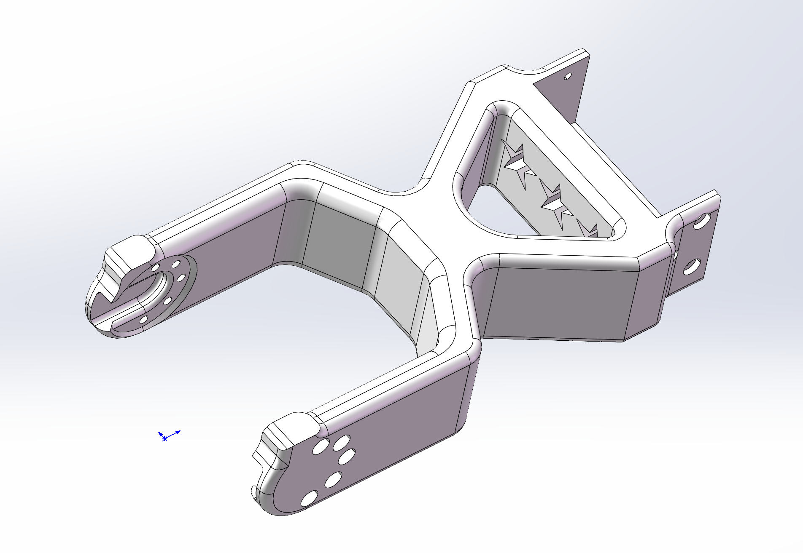
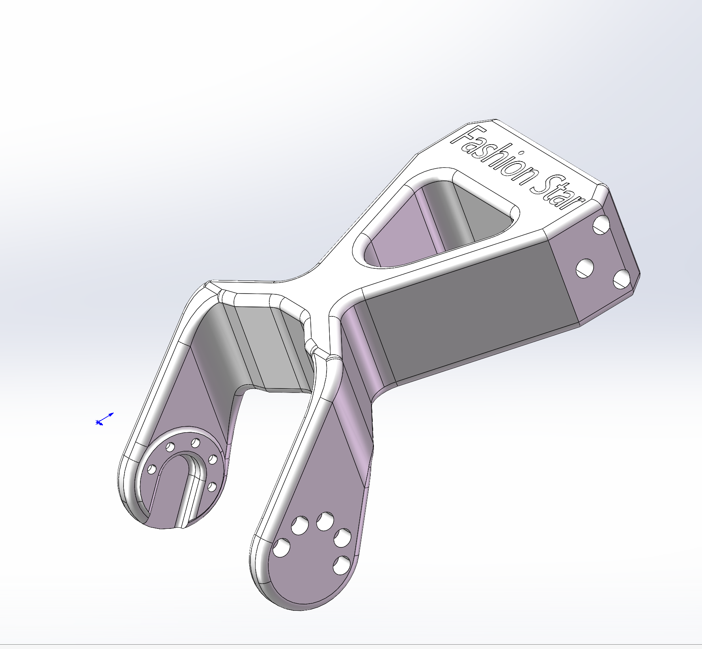
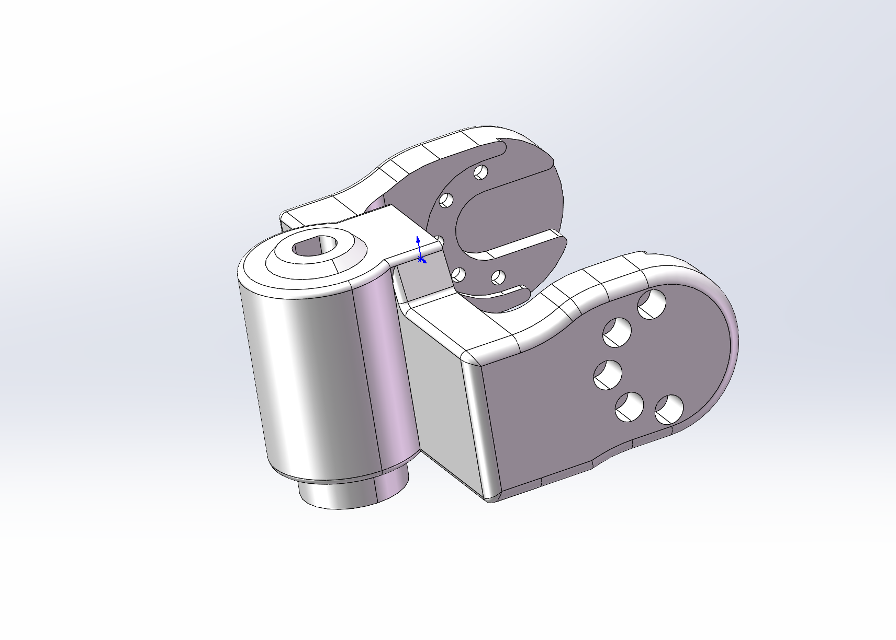
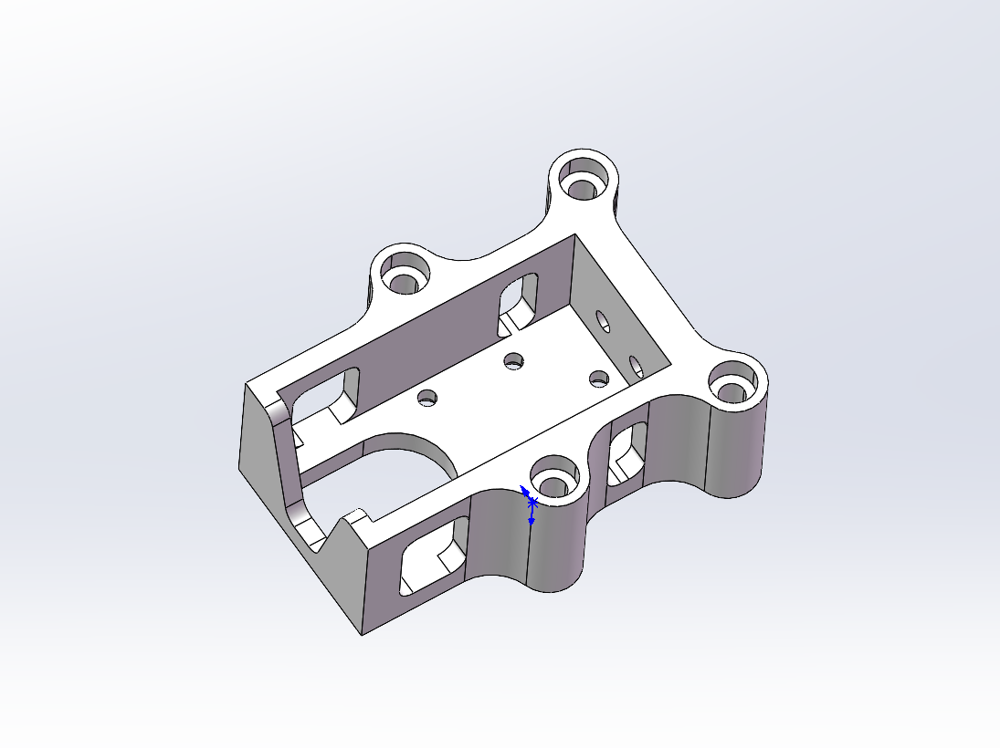
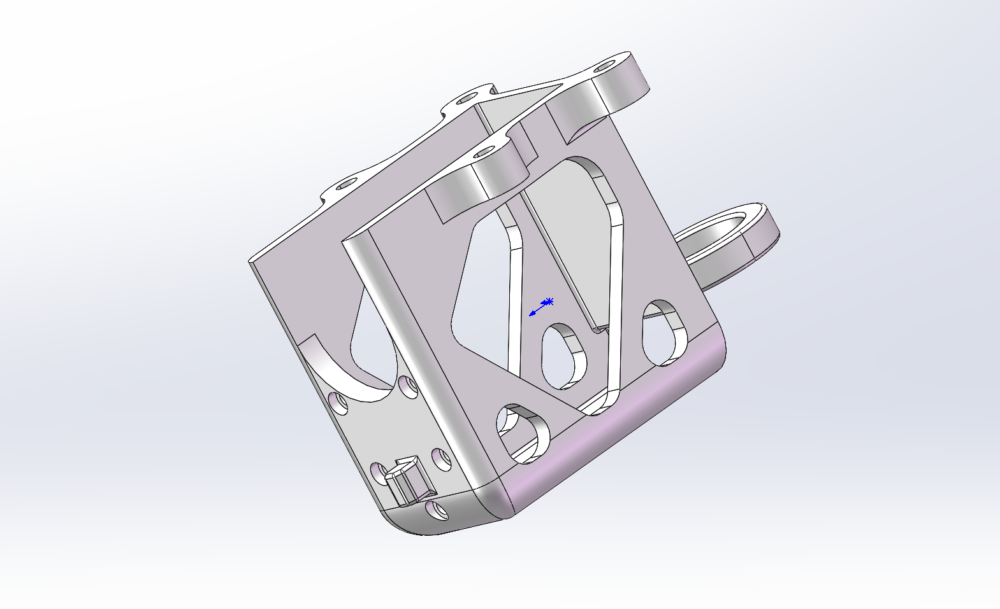
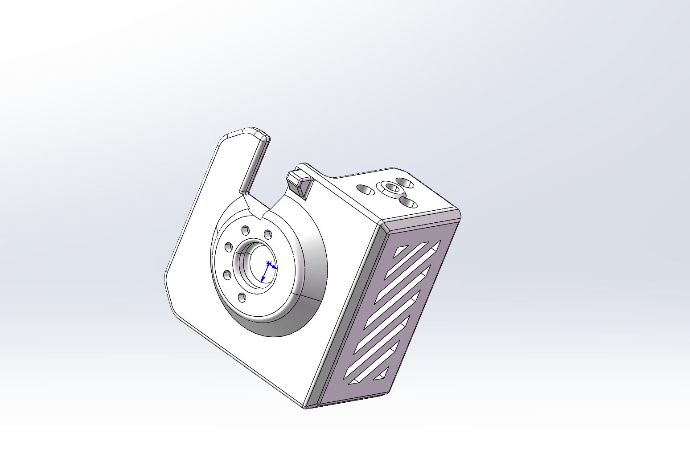
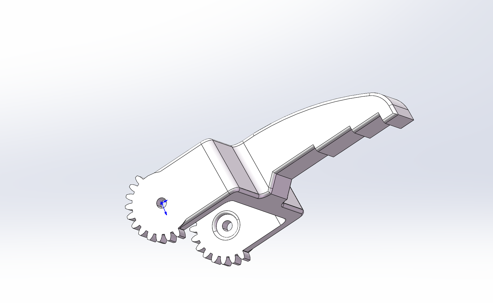
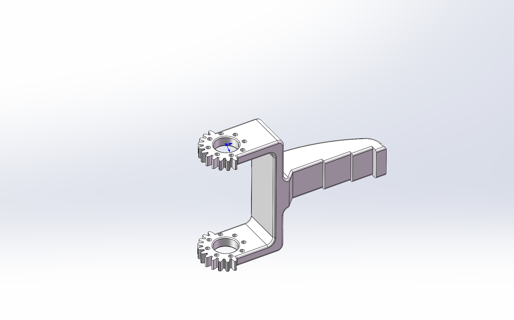

# Star Arm 102-FL hardware

[← Hardware Resources](../README.md)　|　🌐 **English** / [简体中文](README.zh.md)

  
  
  
  
  
  

**On this page:**

- [📂 Resources](#resources)
- [📋 Bill of Materials](#bill-of-materials)

## Resources

| Directory | Description | Status |
| --- | --- | --- |
| [assembly-guide/](assembly-guide/README.md) | Main arm assembly video | ✅ Video available 🟡 Revision and wiring coverage under review |
| [step/](step/) | Part models in parts/; whole-arm assemblies in assembly/ | ✅ Files available 🟡 Revision alignment under review |
| [printing/](printing/) | 3MF projects; STL: [View parts](printing/stl/) · [Download ZIP](printing/stl/star-arm-102-fl-stl.zip) | ✅ 11 individual 3MF files and combined project available; 11 STL files and ZIP available 🟡 Link1 settings conflict with BOM; physical print validation pending |
| [drawings/](drawings/) | PDF / DWG drawings | ✅ Reference files available 🟡 Revision under review |
| [robot-description/](robot-description/) | Model-specific URDF and meshes | — To be added |

## Bill of Materials

The table below lists **29 assembly items** for 102-FL. Missing images are marked pending.

Printed-part names match the STEP, STL, and individual 3MF filenames. Print settings in Notes are references pending physical print validation. The BOM specifies 5 wall loops / 50% infill for link1, while the supplied 3MF uses 2 / 15%; confirm before printing.

| No. | Name | Image | Description | Quantity | Notes |
| :---: | --- | :---: | --- | :---: | --- |
| 1 | RX8-U50H-M | Pending | Firmware V330 | 2 | Installed part |
| 2 | RA8-U35H-M | Pending | Firmware V225 | 3 | Installed part |
| 3 | RA8-U35H-M-C047 | Pending | Single-shaft rear cover; firmware V225 | 1 | Installed part |
| 4 | RA8-U27H-M-C005 | Pending | D-shaft, single-shaft rear cover; firmware V225 | 1 | Installed part |
| 5 | star-arm-102-base-bottom |  | PLA 3D printed part (ivory) | 1 | 2 wall loops; 15% infill |
| 6 | star-arm-102-base-top |  | PLA 3D printed part (ivory) | 1 | Settings vary by region; see 3MF |
| 7 | star-arm-102-link1 |  | PLA 3D printed part (ivory) | 1 | 5 wall loops; 50% infill |
| 8 | star-arm-102-link2 |  | PLA 3D printed part (ivory) | 1 | 2 wall loops; 10% infill |
| 9 | star-arm-102-link3 |  | PLA 3D printed part (ivory + black) | 1 | Settings vary by region; see 3MF |
| 10 | star-arm-102-link4 |  | PLA 3D printed part (ivory) | 1 | 2 wall loops; 15% infill |
| 11 | star-arm-102-link5 |  | PLA 3D printed part (ivory) | 1 | 2 wall loops; 15% infill |
| 12 | star-arm-102-link6-gripper |  | PLA 3D printed part (ivory) | 1 | 4 wall loops; 15% infill |
| 13 | star-arm-102-gripper-body |  | PLA 3D printed part (ivory) | 1 | 4 wall loops; 15% infill |
| 14 | star-arm-102-fingertip-left |  | PLA 3D printed part (ivory) | 1 | 4 wall loops; 15% infill |
| 15 | star-arm-102-fingertip-right |  | PLA 3D printed part (ivory) | 1 | 4 wall loops; 15% infill |
| 16 | Thrust needle roller bearing | Pending | AXK2035 + 2AS | 1 | Installed part |
| 17 | UC-01 board | Pending | XT30 connector | 1 | Installed part |
| 18 | 120 mm servo cable | Pending | PH-3Y, reverse-wired ends, black braided silicone cable | 4 | Installed part |
| 19 | 200 mm servo cable | Pending | PH-3Y, reverse-wired ends, black braided silicone cable | 3 | Installed part |
| 20 | M3 × 10 socket-head screw | Pending | HSCS, grade 12.9 | 1 | Installed part |
| 21 | M3 × 22 socket-head screw | Pending | Black finish | 4 | Installed part |
| 22 | M3 × 10 Phillips screw | Pending | Hardened, black finish | 1 | Installed part |
| 23 | PB2.0 × 5 self-tapping screw | Pending | Phillips countersunk, hardened, black finish | 30 | Installed part |
| 24 | M2 × 4.5 Phillips screw | Pending | Countersunk, black finish, pre-applied threadlocker | 47 | Installed part |
| 25 | M2 × 10 socket-head screw | Pending | Black finish | 8 | Installed part |
| 26 | M2 × 8 socket-head screw | Pending | Black finish | 16 | Installed part |
| 27 | M3 × 12 self-tapping screw | Pending | Phillips head | 2 | Installed part |
| 28 | M3 locknut | Pending | Black finish | 6 | Installed part |
| 29 | M3 washer | Pending | 3 × 6 × 0.5 mm | 2 | Installed part |

Found an error in these resources or need help? Contact our [Support Hub](https://fashionstar.com.hk/support/) with your model and the relevant file or item.
