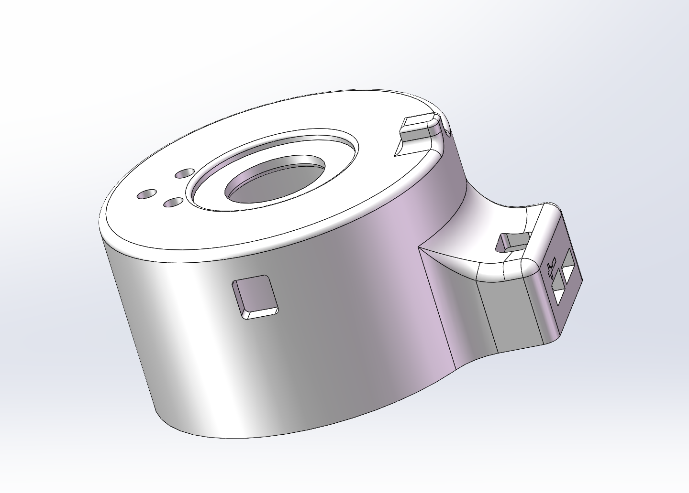
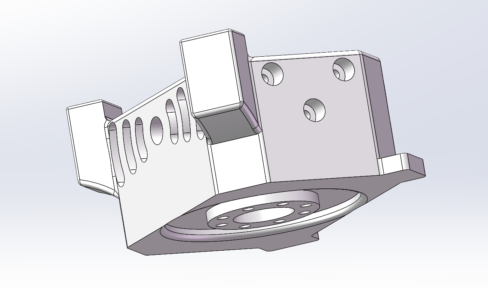
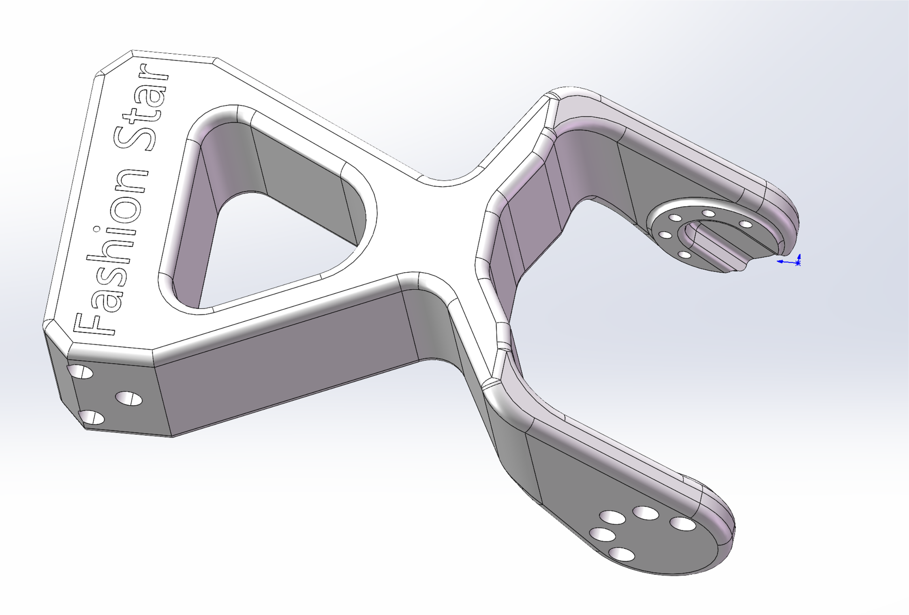
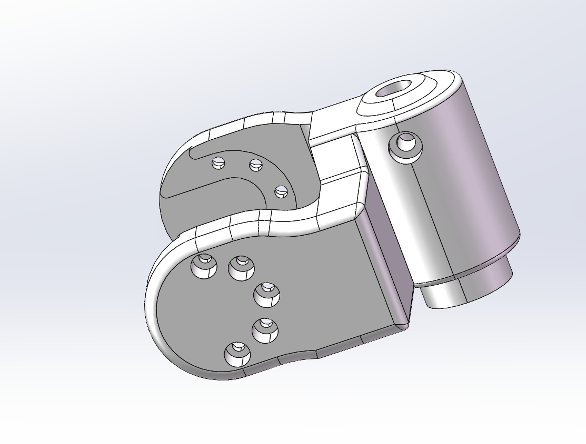
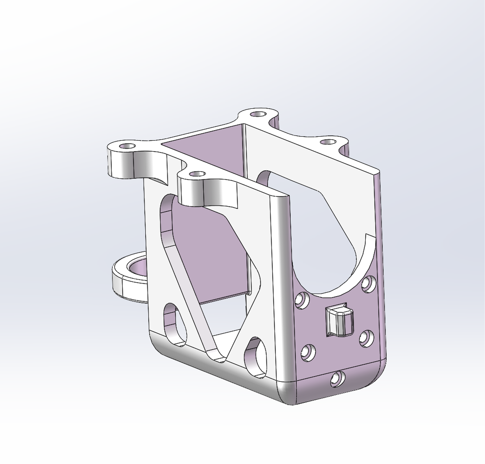
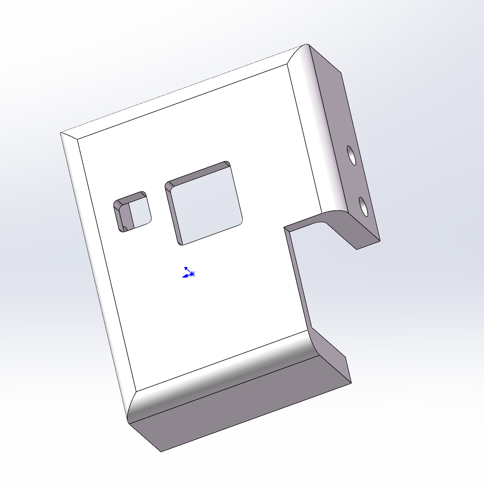
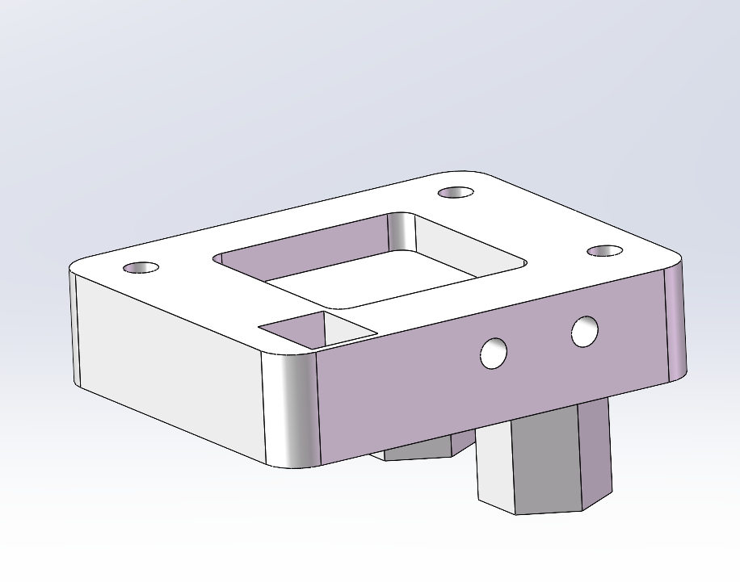

# Star Arm 102-HD 硬件

[← 硬件资源](../README.zh.md)　|　🌐 [English](README.md) / **简体中文**

**本页导航：**

- [📂 资源目录](#resources)
- [📋 物料清单](#bill-of-materials)

## 资源目录

| 目录 | 内容 | 状态 |
| --- | --- | --- |
| [assembly-guide/](assembly-guide/README.zh.md) | 参考 LD 视频并替换 HD 舵机 | ✅ 视频已提供 🟡 HD 按钮说明待补；版本及接线覆盖待核对 |
| [step/](step/) | parts/ 零件模型；assembly/ 共用装配模型 | ✅ 文件已提供 🟡 配套版本待核对 |
| [printing/](printing/) | 3mf/ 打印项目；stl/ 独立打印文件 | ✅ 13 个独立零件 3MF 及整套项目已提供；— STL 未提供 🟡 打印待验证 |
| [drawings/](../102-ld/drawings/) | LD 共用主体参考图（PDF／DWG） | 🟡 HD 专用图纸待提供 |
| [robot-description/](robot-description/) | LD/HD 通用 URDF 模型 ZIP，含网格（ROS 1） | ✅ 压缩包已提供 🟡 RViz 配置待补；关节限位及运行待验证 |

## 物料清单

下表列出 102-HD 的 **31 项装机物料**；无图片的条目标为待补。

打印件名称与 STEP 及独立 3MF 文件名一致。备注中的打印参数仅供参考，尚未完成实物打印验证。

| 序号 | 名称 | 图片 | 描述 | 数量 | 备注 |
| :---: | --- | :---: | --- | :---: | --- |
| 1 | star-arm-102-base-bottom |  | PLA 3D 打印件（象牙白） | 1 | 壁数 2；填充 15% |
| 2 | star-arm-102-base-top |  | PLA 3D 打印件（象牙白） | 1 | 分区域参数，详见 3MF |
| 3 | star-arm-102-link1 |  | PLA 3D 打印件（象牙白） | 1 | 壁数 5；填充 50% |
| 4 | star-arm-102-link2 |  | PLA 3D 打印件（象牙白） | 1 | 壁数 2；填充 10% |
| 5 | star-arm-102-link3 |  | PLA 3D 打印件（象牙白＋黑色） | 1 | 分区域参数，详见 3MF |
| 6 | star-arm-102-link4 |  | PLA 3D 打印件（象牙白） | 1 | 壁数 2；填充 15% |
| 7 | star-arm-102-link5 |  | PLA 3D 打印件（象牙白） | 1 | 壁数 2；填充 15% |
| 8 | star-arm-102-link6-handle |  | PLA 3D 打印件（象牙白） | 1 | 壁数 5；填充 15% |
| 9 | star-arm-102-handle |  | PLA 3D 打印件（象牙白） | 1 | 壁数 2；填充 15% |
| 10 | star-arm-102-finger-ring-left |  | PLA 3D 打印件（象牙白） | 1 | 壁数 2；填充 15% |
| 11 | star-arm-102-finger-ring-right |  | PLA 3D 打印件（象牙白） | 1 | 壁数 2；填充 15% |
| 12 | hd-button-cover |  | PLA 3D 打印件（象牙白） | 1 | 壁数 2；填充 15% |
| 13 | hd-button-base |  | PLA 3D 打印件（象牙白） | 1 | 壁数 2；填充 15% |
| 14 | PCBA | 待补 | UC-01 XT30接口 | 1 | 装机件 |
| 15 | PCBA | 待补 | UK-01带座子 | 1 | 装机件 |
| 16 | 滚针轴承 | 待补 | AXK2035+2AS | 1 | 装机件 |
| 17 | 线材 | 待补 | PH-3Y 双头反向60芯 0.08 黑色硅胶排线L=120 mm  黑色编织线 | 6 | 装机件 |
| 18 | 线材 | 待补 | PH-3Y 双头反向60芯 0.08 黑色硅胶排线L=200 mm  黑色编织线 | 2 | 装机件 |
| 19 | 螺丝 | 待补 | HSCS M3*10 12.9级内六角圆柱头螺钉 | 1 | 装机件 |
| 20 | 螺丝 | 待补 | M3*22黑色内六角 | 4 | 装机件 |
| 21 | 螺丝 | 待补 | M3*10加硬包黑十字槽螺杆 | 1 | 装机件 |
| 22 | 螺丝 | 待补 | PB2.0*5 自攻十字槽加硬包黑沉头螺杆 | 46 | 装机件 |
| 23 | 螺丝 | 待补 | M2*4.5 预点胶十字槽螺杆黑色沉头 | 35 | 装机件 |
| 24 | 螺丝 | 待补 | M2*10 黑色内六角 | 8 | 装机件 |
| 25 | 螺丝 | 待补 | M2*8 黑色内六角 | 8 | 装机件 |
| 26 | 螺丝 | 待补 | M3*12自攻十字槽螺杆 | 2 | 装机件 |
| 27 | 螺母 | 待补 | M3防松螺母 黑色 | 5 | 装机件 |
| 28 | 垫片 | 待补 | M3不锈钢 | 1 | 装机件 |
| 29 | RP8-U45H-M | 待补 | RP8-U45H-M，固件版本V225 | 4 | 装机件 |
| 30 | RP8-U45H-M | 待补 | RP8-U45H-M，半成品， 换单轴后盖，固件版本V225 | 2 | 装机件 |
| 31 | RP8-U45H-M | 待补 | RP8-U45H-M，半成品，D轴，换单轴后盖，固件版本V225 | 1 | 装机件 |

发现资料错误或需要帮助？请通过 [Support 支持中心](https://fashionstar.com.hk/support/) 联系我们，并注明型号及对应文件或条目。
