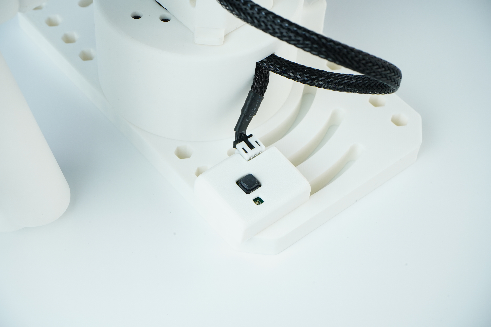

# Star Arm 102-HD Assembly Guide

[← 102-HD Hardware Resources](../README.md)　|　**English** / [简体中文](README.zh.md)

**On this page:**

- [🦾 Arm Assembly](#arm-assembly)
- [🔘 Button Installation & Wiring](#button-installation-wiring)

## 🦾 Arm Assembly

Use Fashion Star’s 102-LD main arm assembly video to assemble your Star Arm 102-HD. Click the preview below to watch on YouTube.

> **For 102-HD: replace the servos shown in the LD video with the corresponding purple coreless bus servos supplied for HD. The remaining main arm assembly steps are the same as for 102-LD.**

✅ Main arm assembly guide complete. Follow the HD servo substitution instructions above.

## 🔘 Button Installation & Wiring

Use the photo below as a reference for the button module’s position on the base, connector orientation, and cable routing. Click the photo to view the full-size image.

