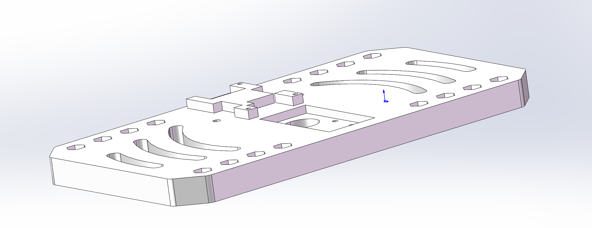
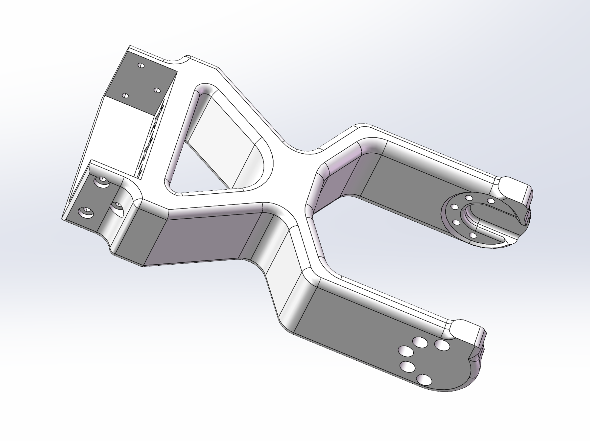
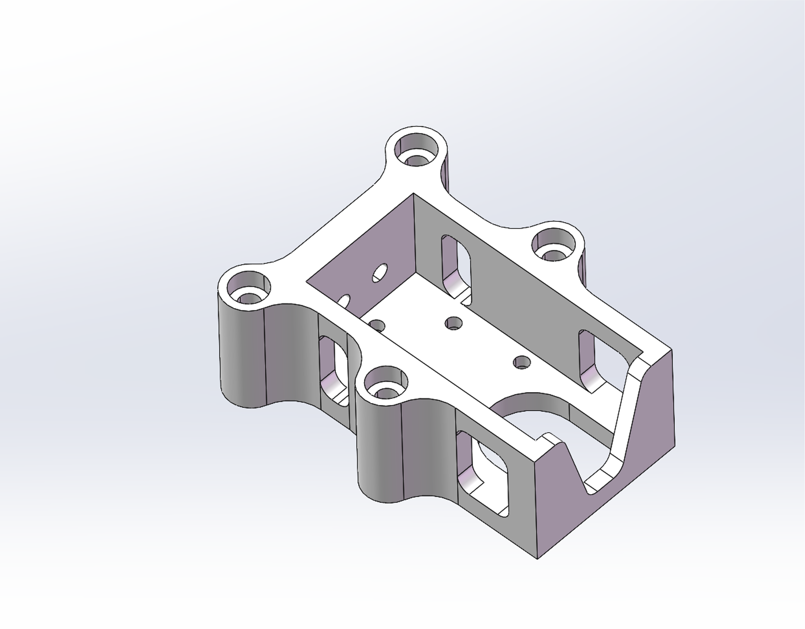
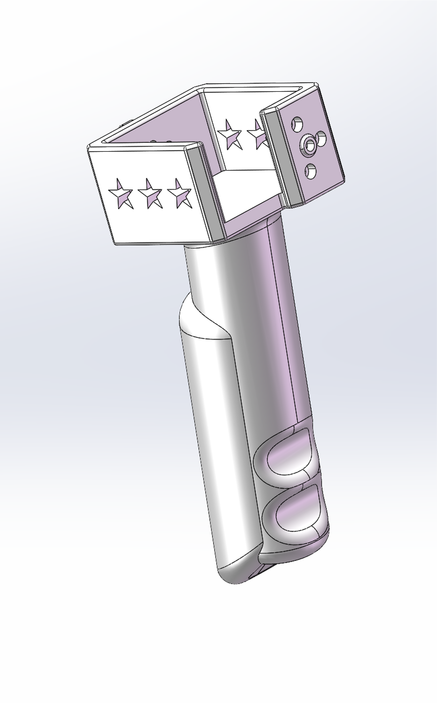
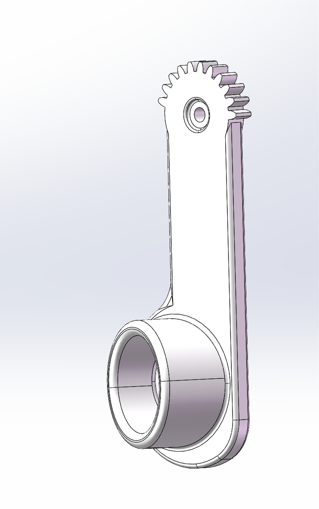
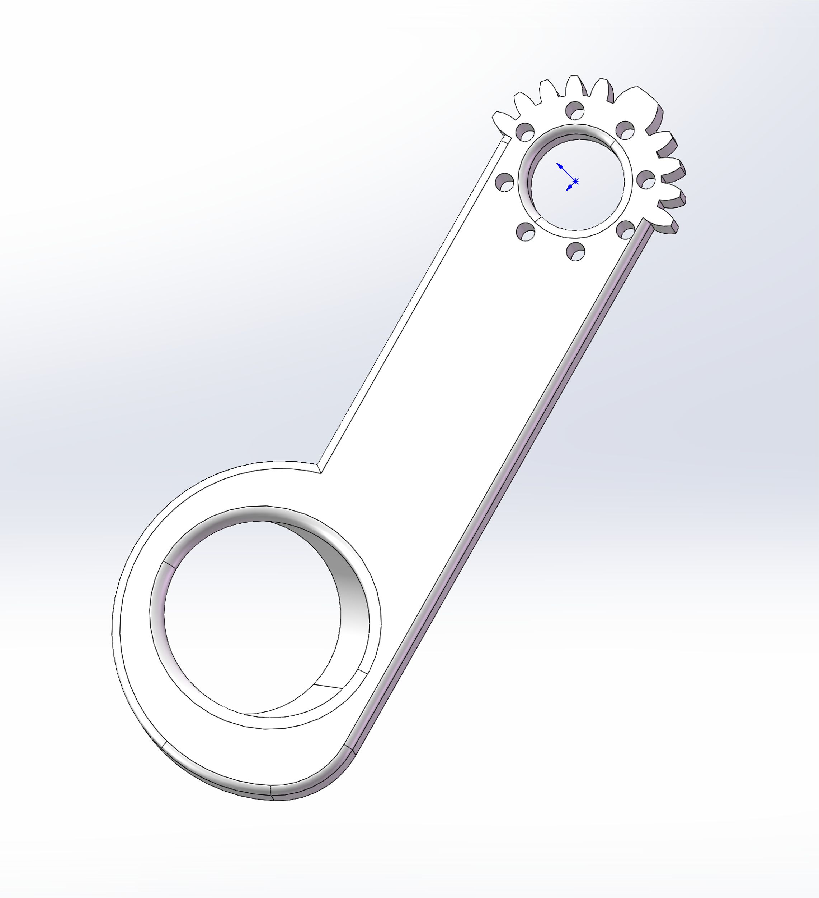

# Star Arm 102-LD hardware

[← Hardware Resources](../README.md)　|　**English** / [简体中文](README.zh.md)

  
  
  
  
  
  

**On this page:**

- [📂 Resources](#resources)
- [📋 Bill of Materials](#bill-of-materials)

## Resources

| Directory | Description | Status |
| --- | --- | --- |
| [assembly-guide/](assembly-guide/README.md) | Main arm assembly video | ✅ Video available 🟡 Revision and wiring coverage under review |
| [step/](step/) | Part models in parts/; shared assembly in assembly/ | ✅ Files available 🟡 Revision alignment under review |
| [printing/](printing/) | 3MF projects; STL: [View parts](printing/stl/) · [Download ZIP](printing/stl/star-arm-102-ld-stl.zip) | ✅ 11 individual 3MF files and combined project available; 11 STL files and ZIP available 🟡 Print validation pending |
| [drawings/](drawings/) | PDF / DWG drawings | ✅ Reference files available 🟡 Revision under review |
| [robot-description/](robot-description/) | ROS 1 package: [Browse source](robot-description/) · [Download ZIP](robot-description/star-arm-102-ld-hd-urdf.zip) | ✅ Source and ZIP available 🟡 Fixed joint5 definition, HD dynamics and runtime pending validation |

## Bill of Materials

The table below lists **28 assembly items** for 102-LD. Missing images are marked pending.

Printed-part names match the STEP, STL, and individual 3MF filenames. Print settings in Notes are references pending physical print validation.

| No. | Name | Image | Description | Quantity | Notes |
| :---: | --- | :---: | --- | :---: | --- |
| 1 | RA8-U01H-M | Pending | Light lubrication; firmware V225 | 4 | Installed part |
| 2 | RA8-U02H-M | Pending | Light lubrication; D-shaft, single-shaft rear cover; firmware V225 | 1 | Installed part |
| 3 | RA8-U03H-M | Pending | Light lubrication; single-shaft rear cover; firmware V225 | 2 | Installed part |
| 4 | star-arm-102-base-bottom |  | PLA 3D printed part (ivory) | 1 | 2 wall loops; 15% infill |
| 5 | star-arm-102-base-top |  | PLA 3D printed part (ivory) | 1 | Settings vary by region; see 3MF |
| 6 | star-arm-102-link1 |  | PLA 3D printed part (ivory) | 1 | 5 wall loops; 50% infill |
| 7 | star-arm-102-link2 |  | PLA 3D printed part (ivory) | 1 | 2 wall loops; 10% infill |
| 8 | star-arm-102-link3 |  | PLA 3D printed part (ivory + black) | 1 | Settings vary by region; see 3MF |
| 9 | star-arm-102-link4 |  | PLA 3D printed part (ivory) | 1 | 2 wall loops; 15% infill |
| 10 | star-arm-102-link5 |  | PLA 3D printed part (ivory) | 1 | 2 wall loops; 15% infill |
| 11 | star-arm-102-link6-handle |  | PLA 3D printed part (ivory) | 1 | 5 wall loops; 15% infill |
| 12 | star-arm-102-handle |  | PLA 3D printed part (ivory) | 1 | 2 wall loops; 15% infill |
| 13 | star-arm-102-finger-ring-left |  | PLA 3D printed part (ivory) | 1 | 2 wall loops; 15% infill |
| 14 | star-arm-102-finger-ring-right |  | PLA 3D printed part (ivory) | 1 | 2 wall loops; 15% infill |
| 15 | Thrust needle roller bearing | Pending | AXK2035 + 2AS | 1 | Installed part |
| 16 | UC-01 board |  | DC power lead: 0.75 mm², 5.5 × 2.1 mm female, 0.15 m | 1 | Installed part |
| 17 | 120 mm servo cable | Pending | PH-3Y, reverse-wired ends, black braided silicone cable | 5 | Installed part |
| 18 | 200 mm servo cable | Pending | PH-3Y, reverse-wired ends, black braided silicone cable | 2 | Installed part |
| 19 | M3 × 10 socket-head screw | Pending | HSCS, grade 12.9 | 1 | Installed part |
| 20 | M3 × 22 socket-head screw | Pending | Black finish | 4 | Installed part |
| 21 | M3 × 10 Phillips screw | Pending | Hardened, black finish | 1 | Installed part |
| 22 | PB2.0 × 5 self-tapping screw | Pending | Phillips countersunk, hardened, black finish | 39 | Installed part |
| 23 | M2 × 4.5 Phillips screw | Pending | Countersunk, black finish, pre-applied threadlocker | 35 | Installed part |
| 24 | M2 × 8 socket-head screw | Pending | Black finish | 16 | Installed part |
| 25 | M2 × 10 socket-head screw | Pending | Black finish | 8 | Installed part |
| 26 | M3 × 12 self-tapping screw | Pending | Phillips head | 2 | Installed part |
| 27 | M3 locknut | Pending | Black finish | 5 | Installed part |
| 28 | M3 washer | Pending | Stainless steel | 1 | Installed part |

Found an error in these resources or need help? Contact our [Support Hub](https://fashionstar.com.hk/support/) with your model and the relevant file or item.
