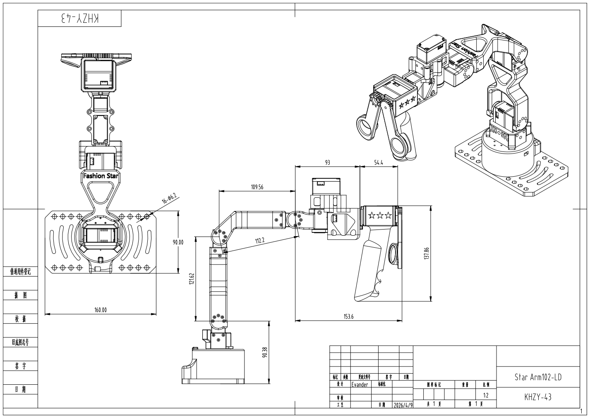

> 中文补充资料：保留原有使用说明。当前版本与英文入口中的兼容性说明为准。

# CAD 图纸与工程文件

本目录用于存放 Star Arm 102-LD 的 CAD 图纸与工程文件，方便查看结构设计、核对关键尺寸。

  

上图展示了 `Star Arm 102-LD` 的整体 CAD 图纸预览。

## 文件说明

- [star-arm-102-ld.pdf](./pdf/star-arm-102-ld.pdf)：用于快速查看与分享的 PDF 图纸
- [star-arm-102-ld.dwg](./cad/star-arm-102-ld.dwg)：可在兼容 CAD 软件中继续编辑的原始工程文件
- [ld-cad.png](./images/ld-cad.png)：本 README 中使用的预览图片

## 使用建议

- 如果你只是想浏览图纸，建议优先使用 `PDF` 文件。
- 如果你需要编辑、复用或继续修改图纸，建议使用 `DWG` 文件。
- 在进行制造前，请确认 CAD 软件中的单位、比例和打印设置是否正确。
